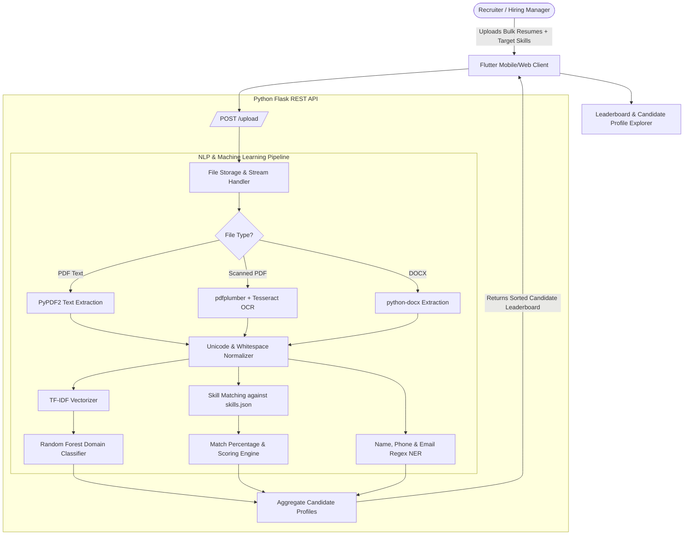

# 📄 AI Resume Screening, Ranking & Candidate Matching System

[](https://flutter.dev/)
[](https://www.python.org/)
[](https://flask.palletsprojects.com/)
[](https://scikit-learn.org/)
[](https://spacy.io/)
[](https://github.com/tesseract-ocr/tesseract)
[](LICENSE)

An end-to-end intelligent recruitment platform that automates candidate resume parsing, contact entity extraction, skill matching, domain classification, and job candidate ranking. Featuring a cross-platform **Flutter** mobile/web frontend and a high-performance **Python/Flask** Machine Learning & NLP backend.

---

## 🌟 Core Concept & Problem Solved

Recruiters and hiring managers spend an average of 6–10 seconds per resume and manually sift through hundreds of applications for a single job opening. Unstructured formats (PDFs, DOCX, scanned image resumes) and inconsistent terminology make manual screening slow, biased, and error-prone.

**This system automates the talent acquisition screening pipeline:**
1. **Multi-Format Ingestion**: Ingests multiple PDF and DOCX resumes in bulk.
2. **Hybrid OCR & Text Extraction**: Extracts clean text using `PyPDF2` and `python-docx`, with automatic fallback to `pdfplumber` + `Tesseract OCR` for scanned image resumes.
3. **Entity & Contact Extraction**: Parses candidate names, phone numbers, and email addresses using specialized NLP heuristics.
4. **Skill Taxonomy Extraction**: Scans resume text against a curated library of tech and domain skills (`skills.json`) and matches against custom job requirement criteria.
5. **Machine Learning Categorization**: Categorizes candidates into professional domains (e.g., Data Science, Web Development, Java Developer, DevOps, HR) using TF-IDF vectorization and a pre-trained Random Forest Classifier.
6. **Candidate Ranking & Leaderboard**: Computes match percentages and ranks applicants in real time to present top candidates first.

---

## 🏗️ System Architecture & ML Pipeline



---

## ✨ Key Features

### 🧠 NLP & Machine Learning Engine
- **OCR Fallback**: Automatically activates Tesseract OCR if standard PDF text extraction yields empty results (handling scanned resumes and image portfolios).
- **Text Normalization**: Strips invalid Unicode, em-dashes, irregular quotes, and redundant whitespace.
- **Skill Extraction & Scoring**: Matches candidate text against both target job keywords and a database of tech skills, calculating precise match percentages.
- **Random Forest Classification**: Classifies resumes into industry job categories based on TF-IDF feature vectors.

### 📱 Flutter Cross-Platform Client
- **Authentication**: Firebase Auth integration for recruiter sign-in and profile management.
- **Bulk Upload**: Multi-file selection with real-time upload progress indicators.
- **Candidate Leaderboard**: Sorted list of applicants ranked from highest to lowest match score.
- **Detailed Candidate Profile**: Skill tags chip cloud, contact quick-actions (call, email), and predicted domain category.
- **Built-in Resume Viewer**: Inspect the original uploaded PDF resume directly inside the application.

---

## 🛠️ Tech Stack & Dependencies

### Backend (Python)
| Library | Purpose |
| :--- | :--- |
| **[Flask](https://flask.palletsprojects.com/)** | REST API framework for uploads, inference, and file serving |
| **[scikit-learn](https://scikit-learn.org/)** | Random Forest Classifier & TF-IDF Vectorizer inference |
| **[spaCy](https://spacy.io/)** (`en_core_web_sm`) | Natural Language Processing & tokenization |
| **[pytesseract](https://github.com/madmaze/pytesseract)** | Optical Character Recognition for scanned resumes |
| **[pdfplumber](https://github.com/jsvine/pdfplumber)** & **[PyPDF2](https://pypdf2.readthedocs.io/)** | High-precision PDF text and layout extraction |
| **[python-docx](https://python-docx.readthedocs.io/)** | Microsoft Word document parsing |
| **[Pillow (PIL)](https://python-pillow.org/)** | Image preprocessing for OCR pipeline |

### Frontend (Flutter)
| Package | Purpose |
| :--- | :--- |
| **[Flutter](https://flutter.dev/)** | Cross-platform UI toolkit |
| **[firebase_auth](https://pub.dev/packages/firebase_auth)** | User authentication |
| **[flutter_screenutil](https://pub.dev/packages/flutter_screenutil)** | Adaptive responsive UI scaling |
| **[file_picker](https://pub.dev/packages/file_picker)** | Native document and multi-file picker |

---

## 📡 REST API Reference

### 1. Bulk Resume Upload & Screening

Upload multiple resumes and rank them against target required skills.

- **Endpoint:** `POST /upload`
- **Content-Type:** `multipart/form-data`
- **Parameters:**
  - `resumes`: Array of files (`.pdf` or `.docx`)
  - `skills`: Comma-separated required skills string (e.g. `"python, machine learning, sql"`)

#### Response (`200 OK`):
```json
{
  "ranked_resumes": [
    {
      "name": "Jane Doe",
      "resume": "Jane_Doe_Resume.pdf",
      "email": "janedoe@example.com",
      "phone": "+1 555-0199",
      "category": "Data Science",
      "matched_skills": ["python", "machine learning", "sql"],
      "match_percentage": 100.0,
      "resume_url": "/resume/Jane_Doe_Resume.pdf"
    },
    {
      "name": "John Smith",
      "resume": "John_Smith_Resume.pdf",
      "email": "johnsmith@example.com",
      "phone": "+1 555-0144",
      "category": "Java Developer",
      "matched_skills": ["sql"],
      "match_percentage": 33.33,
      "resume_url": "/resume/John_Smith_Resume.pdf"
    }
  ]
}
```

---

### 2. Single Resume Deep Extraction

Extract candidate details, skills, and domain category for a single resume.

- **Endpoint:** `POST /pred`
- **Parameters:**
  - `resume`: File (`.pdf` or `.docx`)
  - `skills`: Comma-separated skills string

---

### 3. Categorize Resume

Predict the job category for an uploaded resume.

- **Endpoint:** `POST /categorize`
- **Parameters:** `resume` (File)
- **Response:**
```json
{
  "category": "Web Designing"
}
```

---

### 4. Resume File Serving

Preview or download stored resume files.

- **Endpoint:** `GET /resume/<filename>`
- **Response:** File binary stream

---

## 📁 Repository Structure

```
resume_screening/
├── .env.example                      # Flask server configuration template
├── .gitignore                        # Git rules ignoring venv, uploads, and build artifacts
├── requirements.txt                  # Python dependencies
├── app.py                            # Flask server and API endpoints
├── resume_utils.py                   # OCR, text extraction, NER, and ranking logic
├── skills.json                       # Curated taxonomy of technical and business skills
├── models/                           # Pre-trained ML models & vectorizers
│   ├── rf_classifier_categorization.pkl
│   ├── tfidf_vectorizer_categorization.pkl
│   ├── rf_classifier_job_recommendation.pkl
│   └── tfidf_vectorizer_job_recommendation.pkl
├── uploads/                          # Local storage directory for processed resumes
│   └── .gitkeep
├── lib/                              # Flutter application codebase
│   ├── main.dart                     # Flutter app root & theme
│   ├── screens/
│   │   ├── auth/                     # Login & Signup screens
│   │   ├── uplaod_screen_new.dart    # Resume upload & skill query screen
│   │   ├── results_screen.dart       # Ranked candidate leaderboard
│   │   ├── details_screen.dart       # Candidate detailed breakdown
│   │   └── viewResumePage.dart       # In-app PDF viewer
│   ├── services/                     # Auth and storage service handlers
│   └── utils/                        # Validation utilities
└── pubspec.yaml                      # Flutter dependencies and assets
```

---

## 🚀 Getting Started

### 1. Prerequisites

- **Python 3.9+**
- **Tesseract OCR** installed on your system:
  - **macOS:** `brew install tesseract`
  - **Ubuntu/Debian:** `sudo apt-get install tesseract-ocr`
  - **Windows:** Download installer from [UB-Mannheim Tesseract](https://github.com/UB-Mannheim/tesseract/wiki)
- **Flutter SDK** (for running the mobile app)

---

### 2. Backend Setup

```bash
# Clone the repository
git clone https://github.com/himanshu-0807/resume_screening.git
cd resume_screening

# Create and activate a virtual environment
python3 -m venv venv
source venv/bin/activate   # On Windows: venv\Scripts\activate

# Install dependencies
pip install -r requirements.txt

# Download the spaCy English NLP model
python -m spacy download en_core_web_sm

# Start the Flask API server
python app.py
```

The backend server will run at `http://localhost:5000`.

---

### 3. Flutter App Setup

```bash
# In the project root
flutter pub get

# Run on an emulator or connected device
flutter run
```

---

## 🔒 Privacy & Security

This repository is configured to protect personally identifiable information (PII):
- User-uploaded resumes stored in `uploads/` are automatically excluded from version control via `.gitignore`.
- Pre-trained models are included in `models/` for immediate offline evaluation.

---

## 📄 License

This project is licensed under the [MIT License](LICENSE).
